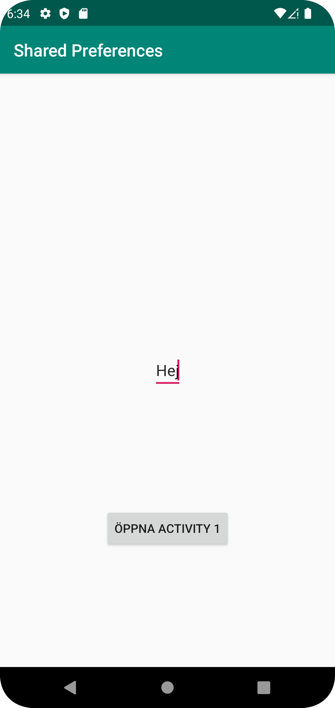

# Rapport

Jag skapar en ny java fil (Activity2.java), sedan kopplar jag MainActivity.java till Activity2.java och genom en knapp kan man besöka Activity2.java. Därefter skapar jag en "EditText" på XML filen "activity_2.xml" och denna gör så att det går att ändra text via appen. Jag skapar en knapp på activity_2.xml och kopplar denna till MainActivity.java, till sist gör jag så att det ska gå att skicka tillbaka datan som fyllts i i EditText till MainActivity.java. En del av koden som får detta att fungera syns nedan.
```
    @Override
    protected void onCreate(Bundle savedInstanceState) {
        super.onCreate(savedInstanceState);
        setContentView(R.layout.activity_2);
        skrivText = findViewById(R.id.editText);
        button = findViewById(R.id.button);
        myPreferenceRef = getSharedPreferences("pref", MODE_PRIVATE);
        button.setOnClickListener(new View.OnClickListener() {
            @Override
            public void onClick(View v) {
                SharedPreferences.Editor editor = myPreferenceRef.edit();
                sendText = skrivText.getText().toString();
                editor.putString("name", sendText);
                editor.apply();
                Log.d("==>", "going back");
                Intent intent = new Intent(Activity2.this, MainActivity.class);
                startActivity(intent);
            }
        });
    }
```





